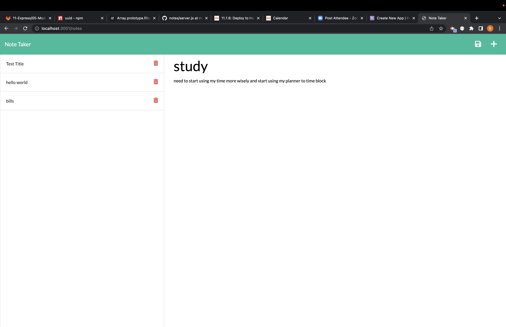

# module 11 challenge

## Title

Notes

## Project Description

* Given a note-taking application user opens the Note Taker then presented with a landing page with a link to a notes page.
* User clicks on the link to the notes page then user is presented with a page with existing notes listed in the left-hand column, plus empty fields to enter a new note title and the note’s text in the right-hand column.
* User enter a new note title and the note’s text then a Save icon appears in the navigation at the top of the page.
* User click on the Save icon then the new note user have entered is saved and appears in the left-hand column with the other existing notes.
* User clicks on an existing note in the list in the left-hand column then that note appears in the right-hand column.
* User clicks on the Write icon in the navigation at the top of the page then user is presented with empty fields to enter a new note title and the note’s text in the right-hand column.

## URL link for heroku

## Screenshot of Product

